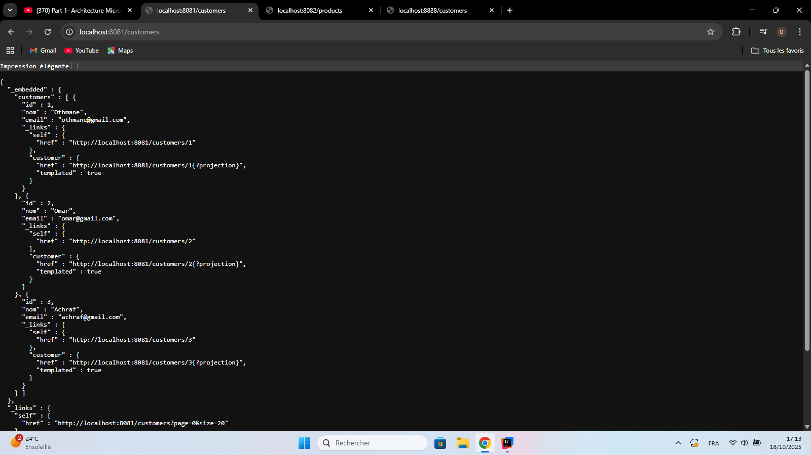
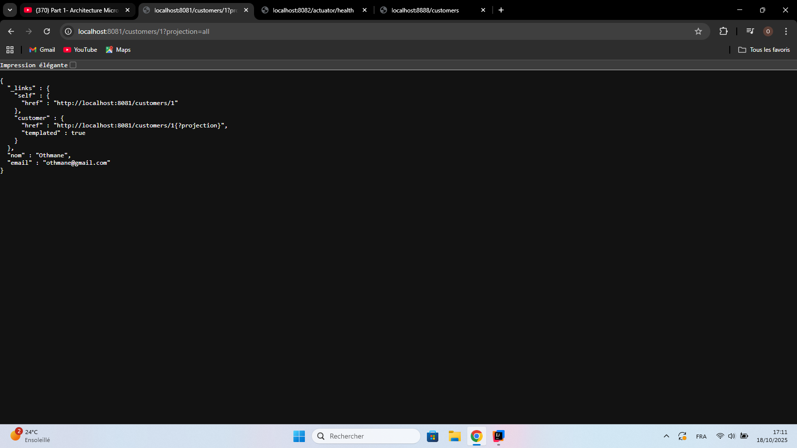
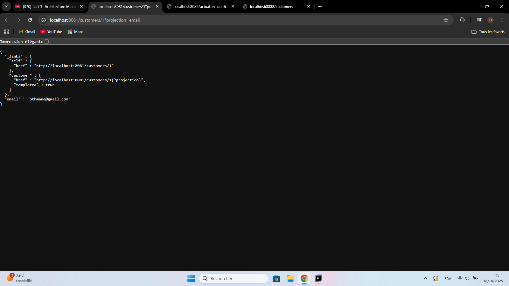
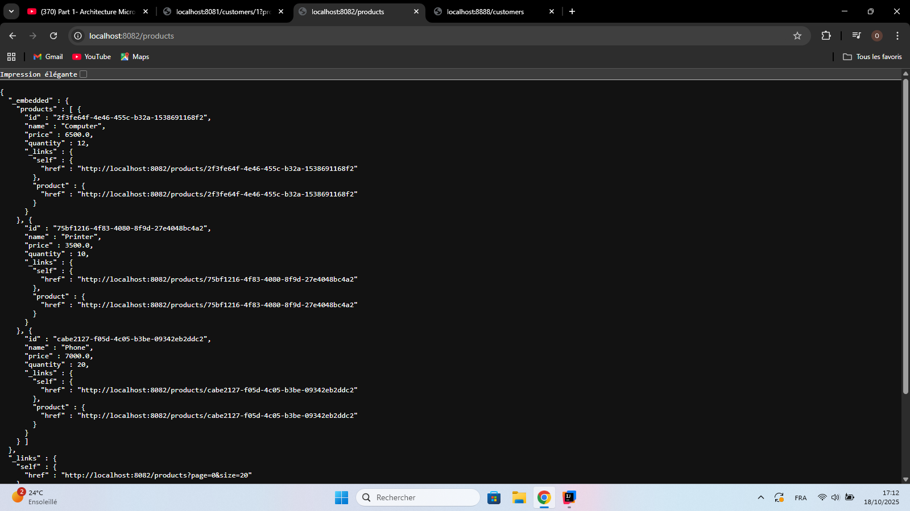
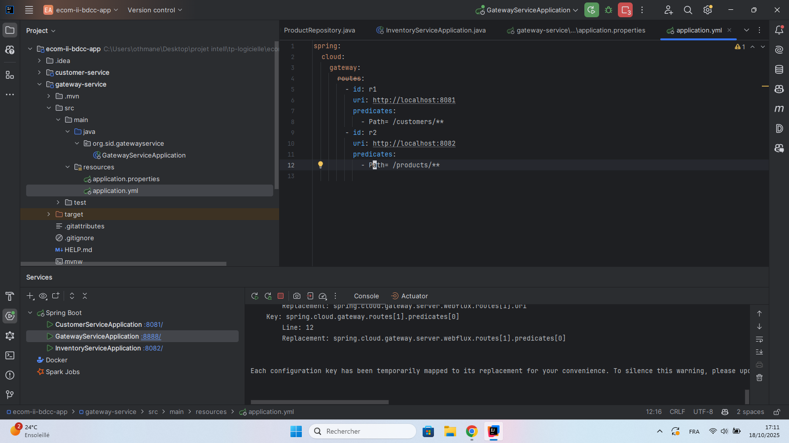
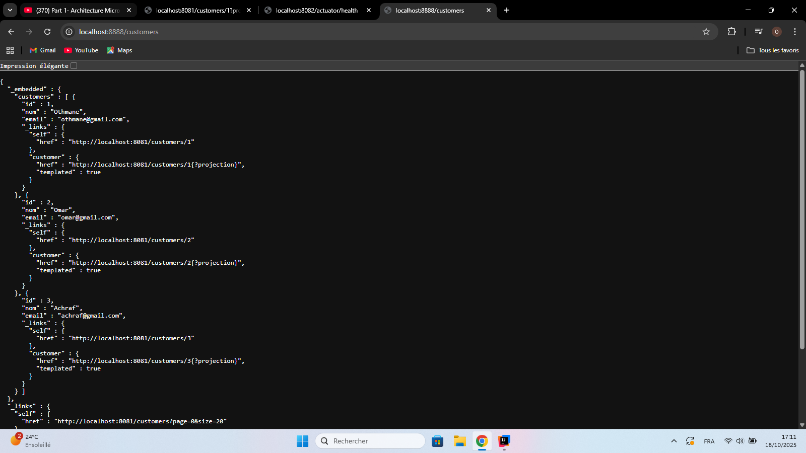
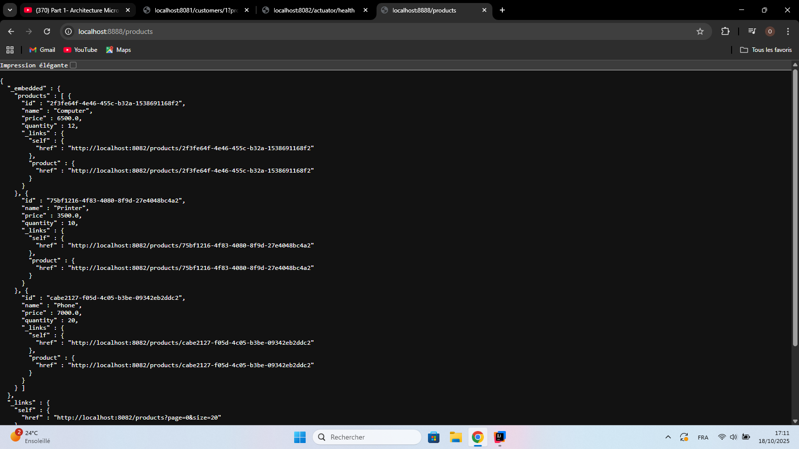
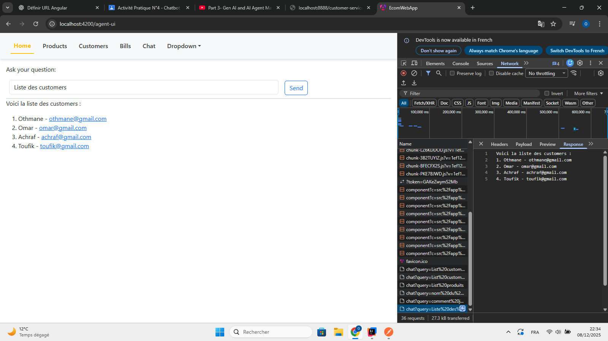
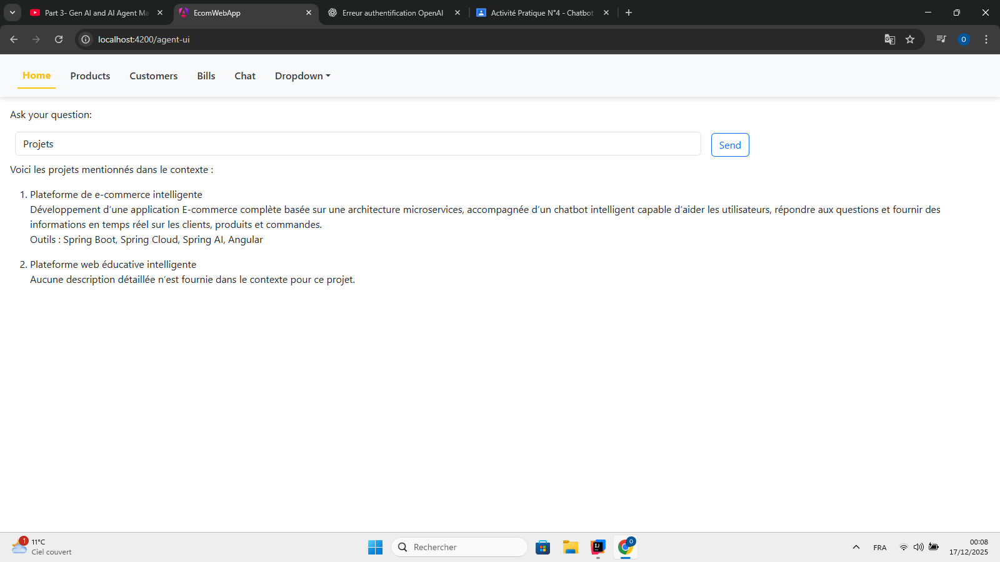
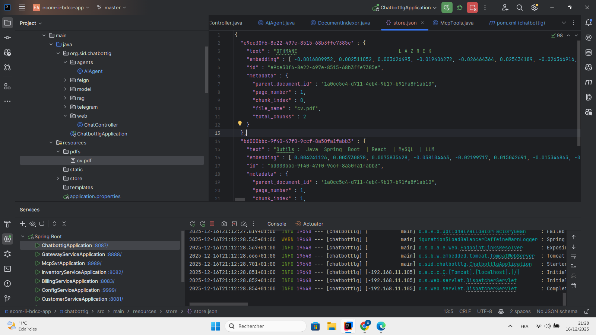

<h1>eureka server</h1>

Le Discovery Service (Eureka) permet d’enregistrer automatiquement l’ensemble des microservices de l’application afin de les rendre détectables entre eux. Chaque service s’inscrit auprès du serveur Eureka au démarrage, ce qui offre une découverte dynamique, sans configuration manuelle des adresses. Grâce à ce registre centralisé, les microservices peuvent communiquer facilement, rester synchronisés et assurer une meilleure résilience du système.

<h1>Micro Service Customer coté backend: </h1>
<h2>Tous les customers: </h2>

<h2>Projection: </h2>
<h3>Projection Customer email and name</h3>

<h3>Projection Customer email</h3>

<h1>Micro Service Products</h1>
<h2>Tous les products: </h2>

<h1>Micro Service Bills: </h1>
<h2>Bill avec les products et customer details: </h2>

<h1>Gateway:</h1>

L’API Gateway sert de point d’entrée unique à toute l’application, en redirigeant les requêtes vers les microservices appropriés. Elle peut fonctionner en routage statique, où les adresses des services sont définies manuellement dans la configuration, ou en routage dynamique, où la Gateway découvre automatiquement les services enregistrés dans Eureka grâce au load balancing (lb://). Ce mécanisme permet une communication centralisée, flexible et simplifiée entre les différents services.

<h2>Statique: </h2>

<h2>Dynamique: </h2>

<h2>routes</h2>
<h3>Customers :</h6>

<h3>Products :</h6>

<h2>Mcp Server:</h2>

<h2>Chatbot :</h2
<h3> Chatbot Telegram</h3>

<h3>Chatbot Angular: </h3>

<h3>Chatbot RAG: </h3>

Split en chunks et stockage sous vecteurs:

